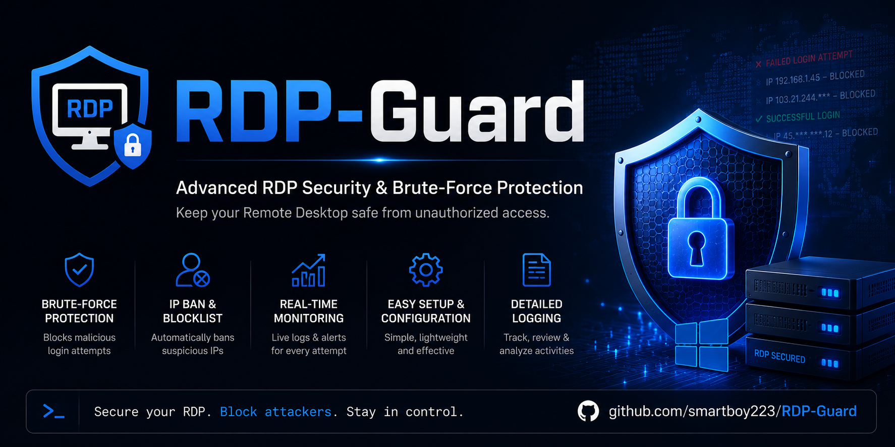

# 🛡️ RDP-Guard

**A local Windows RDP security monitor that hardens exposed Remote Desktop, blocks brute-force scanners, and alerts you when something important happens.**

RDP-Guard is for people who must keep Remote Desktop reachable from the public internet, but still want a stronger safety layer than "change the port and hope nobody finds it." Internet-wide scanners constantly look for RDP. Once they find it, they try usernames, passwords, and repeated connection attempts until something gives.

RDP-Guard adds a fail2ban-style defense for Windows:

- 🚫 **Auto-ban attackers** after repeated failed RDP attempts.
- 🔥 **Keep one clean firewall block rule** instead of hundreds of messy rules.
- 👀 **Monitor successful logins** so you can spot access that was not you.
- 🔔 **Show local Windows toast alerts** for bans and RDP logins.
- 🔐 **Apply RDP hardening** such as NLA, TLS, high encryption, password policy, session limits, and larger Security logs.
- 🧰 **Stay local-only**: no cloud service, no webhook, no telemetry, no third-party account.

> ⚠️ Exposing RDP directly to the internet is always risky. A VPN, RD Gateway, or MFA-gated setup is better when possible. RDP-Guard is the extra protection layer for the real-world case where public RDP must stay open.

## 🚀 Fast Install

Open **Command Prompt as Administrator**, paste this, and press Enter:

```bat
powershell -NoProfile -ExecutionPolicy Bypass -Command "$cmd=Join-Path $env:TEMP 'Install-RDPGuard.cmd'; Invoke-WebRequest -UseBasicParsing 'https://raw.githubusercontent.com/smartboy223/RDP-Guard/main/Install-RDPGuard.cmd' -OutFile $cmd; & $cmd"
```

The bootstrap installer will:

- ask which RDP port to protect,
- download or update files in `C:\Security\RDP-Guard`,
- preserve existing `config.json` values and `state.json` ban history,
- avoid deleting the install folder blindly,
- run `Install.ps1`,
- run `Test-RDPGuard.ps1` validation.

The installer creates the firewall rules, applies hardening, creates the `RDP-Guard` event log, and registers the startup monitor task. The engine runs as `SYSTEM` at startup and every minute.

Already downloaded the repo? Run:

```bat
Install-RDPGuard.cmd
```

## Why You Need This

Changing the RDP port is not enough. It only hides the service from the laziest scans. Real scanners sweep all ports and will eventually find open RDP.

Once found, an exposed RDP service needs more than a firewall allow rule:

- Attackers can flood failed logins and fill your logs.
- NLA pre-auth failures may not always appear as standard Security `4625` events.
- Repeated attempts from the same source should be blocked automatically.
- You need to know when someone successfully logs in, not only when they fail.
- Manual firewall cleanup becomes painful if every bad IP becomes its own rule.

RDP-Guard handles that routine defensive work for you while keeping everything on your machine.

## What It Protects

| Layer | What RDP-Guard Does |
|------|----------------------|
| 🧱 Firewall | Creates one clean public RDP allow rule and one maintained block rule |
| 🚨 Detection | Watches Security `4625` and RDP Core `140` failures |
| ⛔ Blocking | Bans IPs after repeated failures in a time window |
| 📈 Escalation | Repeat offenders get longer bans automatically |
| 🧹 Cleanup | Expired bans are removed from the active firewall rule |
| 🔔 Alerts | Optional local toast notifications for bans and successful RDP logins |
| 📜 Audit | Writes ban/unban events to the local `RDP-Guard` Windows Event Log |
| 🔐 Hardening | Enforces stronger RDP/security settings during install |

## Features

- **Firewall hygiene**: disables stale default RDP rules and replaces ad-hoc rules with one clean inbound rule on your chosen port.
- **Auto-blocker**: watches failed logins and bans offending IPs via a single self-maintaining firewall rule.
- **Better RDP detection**: reads both Security log Event `4625` and `Microsoft-Windows-RemoteDesktopServices-RdpCoreTS/Operational` Event `140`, catching scanners rejected before normal credential events.
- **Real ban expiry**: bans expire automatically, and repeat offenders receive longer bans.
- **CIDR whitelist support**: loopback, LAN, link-local, and private ranges are protected from accidental blocking.
- **Local monitor and alerts**: ban/unban events are written locally, and optional toast alerts appear for new bans and successful RDP logins.
- **Admin commands**: list bans, manually block/unblock, and generate activity reports.

## Requirements

- Windows 10/11 Pro or Windows Server.
- Administrator rights to install.
- Windows PowerShell 5.1 or PowerShell 7+.
- Remote Desktop already enabled on the machine.

## Configuration

All tunables live in `config.json`; the engine re-reads it every run.

| Key | Default | Meaning |
|-----|---------|---------|
| `rdpPort` | `4002` | Your RDP listening port |
| `threshold` | `6` | Failures from one IP before a ban |
| `lookbackMinutes` | `15` | Sliding window for counting failures |
| `banHours` | `24` | Base ban length |
| `escalation` | x2, cap 720h | Repeat offenders get longer bans |
| `whitelist` | RFC1918 + loopback | Never-block ranges, CIDR supported |
| `retentionDays` | `30` | How long expired records are kept for escalation memory |
| `allowRuleName` | `RDP-Guard-Allow` | Managed inbound RDP allow rule |
| `alerts.toast` | `true` | Enable local Windows toast alerts |

## Daily Use

Import the admin module:

```powershell
Import-Module "C:\Security\RDP-Guard\RDP-Guard.Admin.psm1" -Force
```

Useful commands:

```powershell
Get-RDPGuardBans
Get-RDPGuardBans -IncludeExpired
Get-RDPGuardReport -Hours 24
Block-RDPGuardIP -IP 1.2.3.4 -Permanent
Unblock-RDPGuardIP -IP 1.2.3.4
```

View activity with one command:

```powershell
powershell -ExecutionPolicy Bypass -File "C:\Security\RDP-Guard\Show-Activity.ps1" -Hours 72
```

Raw event log:

```powershell
Get-WinEvent -LogName 'RDP-Guard' -MaxEvents 20
```

## Local Security Monitor

The monitor is the part that makes this more useful than a one-time hardening script.

Every minute, the scheduled task:

1. Reads recent failed RDP events.
2. Counts failures by source IP.
3. Skips trusted/whitelisted ranges.
4. Adds or extends bans for repeated attackers.
5. Expires old bans.
6. Rebuilds one Windows Firewall block rule.
7. Writes a local event log entry.
8. Triggers optional local toast alerts.

Successful RDP logins are also visible in the activity report and can trigger a toast notification. That matters because the most important signal is not only "someone failed"; it is "someone got in."

## Validate Setup

Run:

```powershell
powershell -ExecutionPolicy Bypass -File "C:\Security\RDP-Guard\Test-RDPGuard.ps1"
```

The validator checks config, event log, scheduled tasks, firewall rules, listening port, and the full ban pipeline. It blocks a reserved test IP, verifies it appears in state/firewall/event log, then removes it.

## Optional MFA

The strongest upgrade for exposed RDP is MFA at Windows logon:

- [Duo Authentication for Windows Logon](https://duo.com/docs/rdp)
- [multiOTP Credential Provider](https://github.com/multiOTP/multiOTPCredentialProvider)

RDP-Guard does not bundle these. It stays self-contained and local-only, but MFA is strongly recommended if your endpoint is exposed.

## If You Lock Yourself Out

From console access or another admin path:

```powershell
Import-Module "C:\Security\RDP-Guard\RDP-Guard.Admin.psm1" -Force
Unblock-RDPGuardIP -IP <your-public-ip>
```

Emergency clear:

```powershell
Get-NetFirewallRule -DisplayName 'RDP-Guard-Block' | Remove-NetFirewallRule
```

## Uninstall

```powershell
powershell -ExecutionPolicy Bypass -File "C:\Security\RDP-Guard\Uninstall.ps1"
```

Options:

- `-RemoveEventLog`: delete the custom `RDP-Guard` event log.
- `-RemoveAllowRule`: remove the RDP allow rule. This closes RDP through the firewall.

Hardening settings are intentionally left in place.

## Files

| File | Purpose |
|------|---------|
| `Install-RDPGuard.cmd` | Safe bootstrap installer/updater with RDP port prompt |
| `Install.ps1` / `Uninstall.ps1` | Setup and teardown |
| `RDP-Guard.ps1` | Auto-blocker engine run by the scheduled task |
| `RDP-Guard.Common.ps1` | Shared config, state, CIDR, firewall, and logging helpers |
| `RDP-Guard.Admin.psm1` | Admin commands and reporting |
| `Show-Activity.ps1` / `View-Activity.cmd` | Activity viewer |
| `Test-RDPGuard.ps1` / `Validate-Setup.cmd` | End-to-end validation |
| `RDP-Guard.Toast.ps1` | Local toast popups |
| `config.json` | Tunable settings |
| `state.json` | Runtime ban state, ignored by git |

## Disclaimer

Provided as-is, no warranty. You are responsible for testing it in your own environment and for the security of your systems. Exposing RDP to the internet carries inherent risk.

## License

[MIT](LICENSE)
